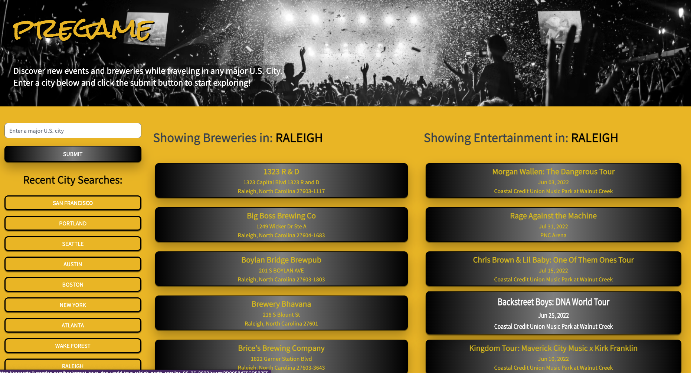

# Pregame

Pregame is an application that helps you search for breweries, concerts, and other events in any major U.S. city. Discover new events and brews while traveling, or even in your home town.

## :notes: How to use Pregame :beers:

When you arrive at the Pregame homepage, enter a major US city in the search bar and a list of live events and breweries will display on the page.

## :rocket: Launch

- [Click to visit Pregame](https://gilinamcbride.github.io/pregame/)

## Tech

This application was built with the help of the following languages and APIs:

- HTML
- CSS
- JavaScript
- [Open Brewery DB](https://www.openbrewerydb.org/)
- [TicketMaster API](https://developer.ticketmaster.com/products-and-docs/apis/discovery-api/v2/#anchor_find)

## Requirements

**_User Story_**

- **AS A** traveler or hometown adventurer
- **I WANT** to be able to search for breweries and live events by city
- **SO THAT** I can discover new brews, bands, sporting events, and buddies

**_Acceptance Criteria_**

- **GIVEN** that I've navigated to the Pregame application
- **WHEN I** enter a major U.S. city in the search box
- **THEN I** am presented with a list of live events in the selected city and
- **THEN I** am also presented with a list of breweries and cideries in the selected city
- **WHEN I** click on the brewery information
- **THEN I** am taken to the brewery website
- **WHEN I** click on the event information
- **THEN I** am taken to the TicketMaster page to buy tickets for the event
- **WHEN I** search for a city
- **THEN** the city is saved in the recent search
- **WHEN I** click clear history
- **THEN** all of the search history is cleared from the page

**_Future Iterations_**
Moving forward future iterations of the application would include:

- A map of the searched city that had pins of the brewery locations and venue locations searched
- The search would include more than just major US cities - it would also render breweries and events in smaller towns and global cities
- More search options including wineries and local bars for those who don't enjoy beer
- Specific search filtes or dropdown menus, including searching by type of event, or type/brand of beer

**_Presentation_**

[Link to presentation](https://docs.google.com/presentation/d/e/2PACX-1vSy3JX3KlryuFhdNjNQQ-31SngdBjCM9PU4QVDaRevjvZEbuhgkq1NMT9P8pITl3_1qI5_4CVYXY8J7/pub?start=false&loop=false&delayms=3000)

## Grading Requirements:

- Use a CSS framework other than Bootstrap.
- Be deployed to GitHub Pages.
- Be interactive (i.e., accept and respond to user input).
- Use at least two server-side APIs.
- Does not use alerts, confirms, or prompts (use modals).
- Use client-side storage to store persistent data.
- Be responsive.
- Have a polished UI.
- Have a clean repository that meets quality coding standards (file structure, naming conventions, follows best practices for class/id naming conventions, indentation, quality comments, etc.).
- Have a quality README (with unique name, description, technologies used, screenshot, and link to deployed application).

## Presentation Requirements

- **Elevator pitch:** A one-minute description of your application.
- **Concept:** What is your user story? What was your motivation for development?
- **Process:** What were the technologies used? How were tasks and roles broken down and assigned? What challenges did you encounter? What were your successes?
- **Demo:** Show your stuff!
- **Directions** for future development.
- **Links** to the deployed application and the GitHub repository.

## Credits

Thank you to everyone on the team for your contributions!

- [Gilina](https://github.com/gilinamcbride)
- [Donnie](https://github.com/Atlas075)
- [Drew](https://github.com/DrewMcKinney23)
- [Caren](https://github.com/cammeer)

